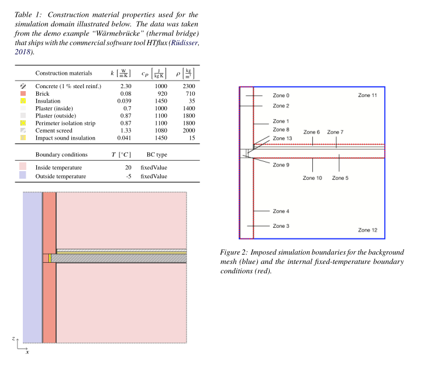
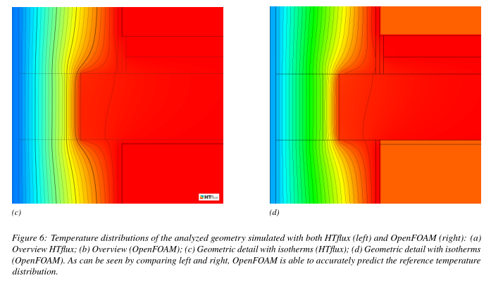
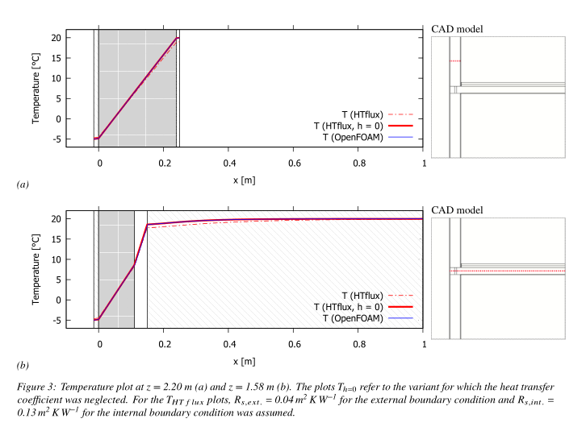

# HeatFlux

This case is based on [this paper](https://www.researchgate.net/publication/346039320_Solving_Thermal_Bridging_Problems_for_Architectural_Applications_with_OpenFOAM) titled _Solving Thermal Bridging Problems for Architectural Applications
with OpenFOAM_ submitted to the SimAUD 2020 conference.

## What it does

This may be seen as a framework to assess heat transfer problems which can be automatically generated by Grasshopper.

## Abstract

Although recent advancements in computational architecture show promising capabilities, it remains difficult for architects to conduct advanced simulations due to the limited software interoperability. For thermal bridging analyses, the architectural community traditionally relies on specific software tools that are not integrated into a CAD environment. To integrate such analyses into the ongoing design process, we implement a software tool to run heat transfer simulations with OpenFOAM from Grasshopper and Rhinoceros. This paper presents an implementation for box-shaped geometries and compares its results to a thermal bridge analysis from a validated simulation engine. We show that OpenFOAM’s chtMultiregionFoam solver is capable of accurately predicting temperature distributions in a geometry setup with 13 different regions and 8 different materials. In conclusion, we show that heat transfer studies can be highly automated and integrated into an iterative design process.


## Geometry used




## Results

### Temperature distribution



### Cross-section temperature plots




## How to run the case

 - Install [BlueCFD](https://github.com/blueCFD/Core/releases/download/blueCFD-Core-2017-2/blueCFD-Core-2017-2-win64-setup.exe) in the default folder: `C:\Program Files\blueCFD-Core-2017`
 - Start `run_all.bat`


## Citation

Please cite our work if you decide to use this for your own research.

### APA

```
Kastner, P. and Dogan, T., 2020. Solving Thermal Bridging Problems for Architectural Applications with OpenFOAM. In: SimAUD 2020. [online] Available at: https://www.researchgate.net/publication/346039320_Solving_Thermal_Bridging_Problems_for_Architectural_Applications_with_OpenFOAM.
```

### Bibtex

```
@inbook{kastner_dogan_2020a, 
 title={Solving Thermal Bridging Problems for Architectural Applications with OpenFOAM}, 
 url={https://www.researchgate.net/publication/346039320_Solving_Thermal_Bridging_Problems_for_Architectural_Applications_with_OpenFOAM}, 
 booktitle={SimAUD 2020}, 
 author={Kastner, Patrick and Dogan, Timur}, 
 year={2020} 
}
```
